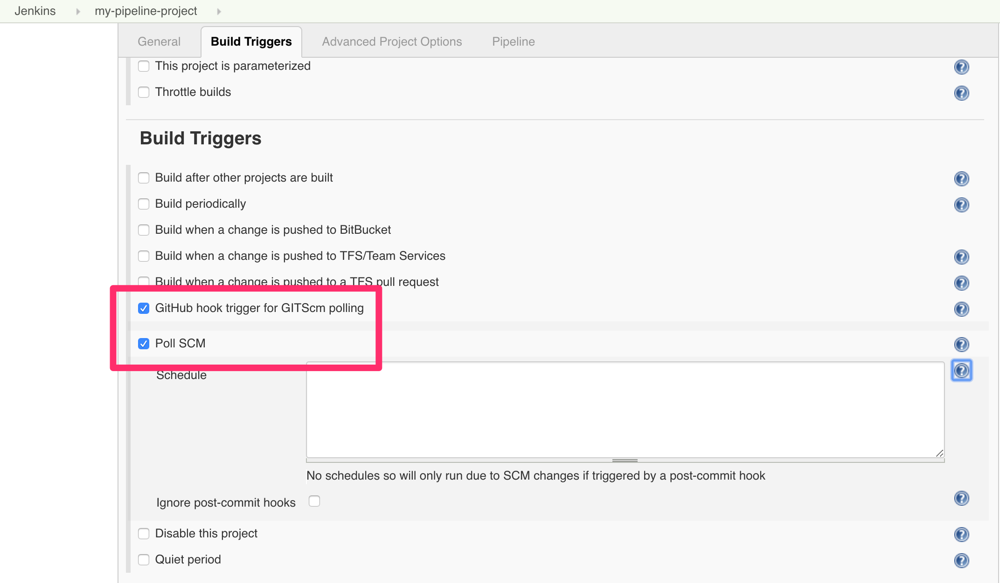

# devops-pipeline

(c) Adrian Newby, 2019

## Introduction

This repo provides a fairly comprehensive environment, suitable for a developer who wants a local DevOps pipeline in addition to whatever is available centrally (if anything). This provides a number of benefits:

* Instant feedback from local commits
* Lower burden on central resources
* Higher confidence in quality of code pushed to origin

__However:__ That doesn't mean this environment should be used as a substitute for central DevOps services, nor should this be seen as encouragement to delay committing work to origin.  Remember, it's not real until it's been pushed and high quality DevOps relies on each member of the team being able to see and incorporate the work of everybody else.

This project was inspired by the work of [Marcel Birkner](https://blog.codecentric.de/en/author/marcel-birkner/), who authored a great CI Platform in 2015: [Continuous Integration Platform Using Docker Containers: Jenkins, SonarQube, Nexus, GitLab](https://blog.codecentric.de/en/2015/10/continuous-integration-platform-using-docker-container-jenkins-sonarqube-nexus-gitlab/).

Why didn't I just use his work?  Good question.  Basically, I wanted a slightly more bare-bones approach, without the vast array of plugins and starter jobs he included.  I also decided it would be easier to build from the ground up, taking care of version updates as I went, rather then editing his original work, which is now several years old.

## Overview

What do you get out of the box?

The project provides the following components, all of which are essential for a modern DevOps pipeline:

* CI/CD Server - [Jenkins](https://jenkins.io/)
* Static Code Analysis - [SonarQube](https://www.sonarqube.org/)
* Automated Testing - [Jasmine](https://jasmine.github.io/), [Protractor](https://www.protractortest.org), JUnit??, NUnit??
* Artifact Repository - [Nexus](https://www.sonatype.com/nexus-repository-oss)
* Orchestrated Container Environment - [Kubernetes](https://kubernetes.io/)

For efficiency, all components are delivered as Docker containers.

## Prerequisites

To get started, you need a couple of things:

* [Docker](https://www.docker.com/get-started) - This entire project is delivered using Docker. If you're not familiar with containers, read [this](https://www.docker.com/resources/what-container) first.
* [Git](https://git-scm.com/) - The environment assumes you are working with a Git repository.  It will probably work with other repos but you will have to configure the hooks yourself.

If your environment is properly-configured, you should see something like this:

```
$ docker --version
Docker version 18.06.1-ce, build e68fc7a

$ git --version
git version 2.19.2
```

## Launching the environment

### Declare a user-defined network

One feature of Jenkins pipelines is the ability to use Docker containers as *agents* to execute pipeline steps.  This is very cool, because those containers can include whatever software the pipeline step requires, making it unnecessary to configure a big, bloated Jenkins environment.  (It also makes it possible to containerize the Jenkins CI/CD pipeline since we don't have to anticipate what every development project may require.)

However, those containers often need to communicate with the core pipeline services (e.g. SonarQube / Nexus). The easiest way to do this reliably is to have all containers be part of the same Docker network and then use the hostnames declared in the ```docker-compose.yml``` to reach those core services - much easier and more reliable than using network gymnastics to try and discover host IPs or rely on external port mapping to the Docker host.

To achieve this, create a user-defined network *before* launching the Jenkins pipeline environment:

```
$ docker network create -d bridge devopsnetwork
<a long network ID will be displayed>
```

The core pipeline environment expects this network to exist and will report an error if it is not found.  Provided the network exists, the core pipeline services will join this network when they are launched using ```docker-compose``` (see below).

Because this network is declared external to the docker-compose environment, it will *also* be joinable by any containers launched by Jenkins pipelines e.g.:

```
agent {
	docker {
		image 'acanewby/sonar-scanner:3.3.0-alpine'
		args '--network="devopsnetwork"'
	}
}
```

### Map your local repositories into Jenkins' filespace

In order for Jenkins to see your code repository, and detect buildable changes on commit, you need to map it to a known location in Jenkins' filespace.  To do this, declare an environment variable ```MY_REPOS```, which identifies the location of your local repository.

Notice that ```MY_REPOS``` is plural.  It's likely that you will have more than one repository you want to hook tyo a local CI/CD pipeline. The best way to do this is to arrange all your local repository clones under a common root, which you can then identify to ```MY_REPOS```:

```
MY_REPOS=/Users/<you>/repos
export MY_REPOS
```

### Launch the pipeline

The pipeline is structured using ```docker-compose```.  

To launch it, change to the repository root directory and then start the environment:

```
$ docker-compose up -d --build
Creating network "devops-pipeline_devopsnetwork" with driver "bridge"
Building sonardb
Step 1/1 : FROM postgres:9.6
 ---> ed34a2d5eb79
 .
 .
 <snip/>
 .
 .
 Step 32/32 : RUN /bin/chmod a+x ${SCRATCH}/fix-docker-sock.sh
 ---> Running in c677b483cd9a
Removing intermediate container c677b483cd9a
 ---> f04bda75c8c3
Successfully built f04bda75c8c3
Successfully tagged devops-pipeline_jenkins:latest
Creating devops-pipeline_sonardb_1 ... done
Creating devops-pipeline_sonar_1   ... done
Creating devops-pipeline_jenkins_1 ... done
$
```

### Post-launch fixup

This is a hack but the only alternative is to launch the entire environment as ```root```, which is just asking for trouble.  

The issue is that the ```jenkins``` user inside the Jenkins container needs to be able to communicate with the Docker daemon running in your native environment so that Jenkins can run containers as necessary during its build operations.  (This is not "Docker-in-Docker", which presents its own set of complex problems.  This is "run Docker containers from inside Jenkins alongside the containers launched from your native platform".)

The problem is that, out of the box, the Docker socket bind-mounted into the Jenkins container is not accessible by the ```jenkins``` user.  We need to modify its access permissions, and we have a script to do it, ready and waiting inside the container:

First, get the ID of the running Jenkins container:

```
$ docker ps | grep devops-pipeline_jenkins | awk '{print $1}'
<copy this ID>
```

Then, launch an interactive shell inside the container:

```
$ docker exec -ti <your copied ID> /bin/bash
bash-4.4# pwd
/scratch
bash-4.4# ls -l
total 4
-rwxr-xr-x 1 root root 195 Jan 22 06:19 fix-docker-sock.sh
```

Now, run the fixup script:

```
bash-4.4# ls -l /var/run/docker.sock
srw-rw---- 1 root root 0 Jan 21 21:42 /var/run/docker.sock

bash-4.4# ./fix-docker-sock.sh
chmod'ing Docker Socket ...

bash-4.4# ls -l /var/run/docker.sock
srw-rw-rw- 1 root root 0 Jan 21 21:42 /var/run/docker.sock
```

*Note: You only have to do this the first time you create the container.  The permissions fix will persist across start/stop events.  It's benign though, so no harm if you run it again, just to make sure.*

### Configured services and access points

Once launched, you will find the following access poiunts avcailable from your local browser:

| *Tool*        | *Link*                  | *Credentials*     |
| ------------- | ----------------------- | ----------------- |
| Jenkins       | http://localhost:18080/ | no login required |
| SonarQube     | http://localhost:19000/ | admin/admin       |
| Nexus         | http://localhost:18081/ | admin/admin123    |

## Integrating with your local repository

The purpose of this project is to give the developer a *local* CI/CD pipeline to allow for more immediate feedback as commits are made locally, prior to pushing to origin.

This CI/CD pipeline is also not visible outside the local development environment.
 
Therefore, since no push to origin means no WebHook trigger, and since a WebHook couldn't reach the local CI/CD pipeline environment anyway, we need to hook to the local clone of the repository on the local filesystem.  

### Declare and configure a Jenkins build for your project

From the Jenkins home page, select New Item:


Create a Pipeline (using your repository name as the Pipeline name):


Configure Jenkins to use the Jenkinsfile in your repository:


Trigger builds from a Git hook:



### Add a hook in your repository to trigger a Jenkins build on commit

Now that Jenkins is ready to build on commit, you need to set up a git hook in your local repository. (Note: This hook will remain specific to your repository and will not be pushed to origin.  This is by design, since hooks are, by their nature, repository-specific.)

Create ```<your local repository>/.git/hooks/post-commit``` as follows"

```
#!/bin/bash
curl http://localhost:18080/git/notifyCommit?url=file:///repos/my-pipeline-project
```

Then, mark it world-executable:

```
chmod a+x <your local repository>/.git/hooks/post-commit
```


