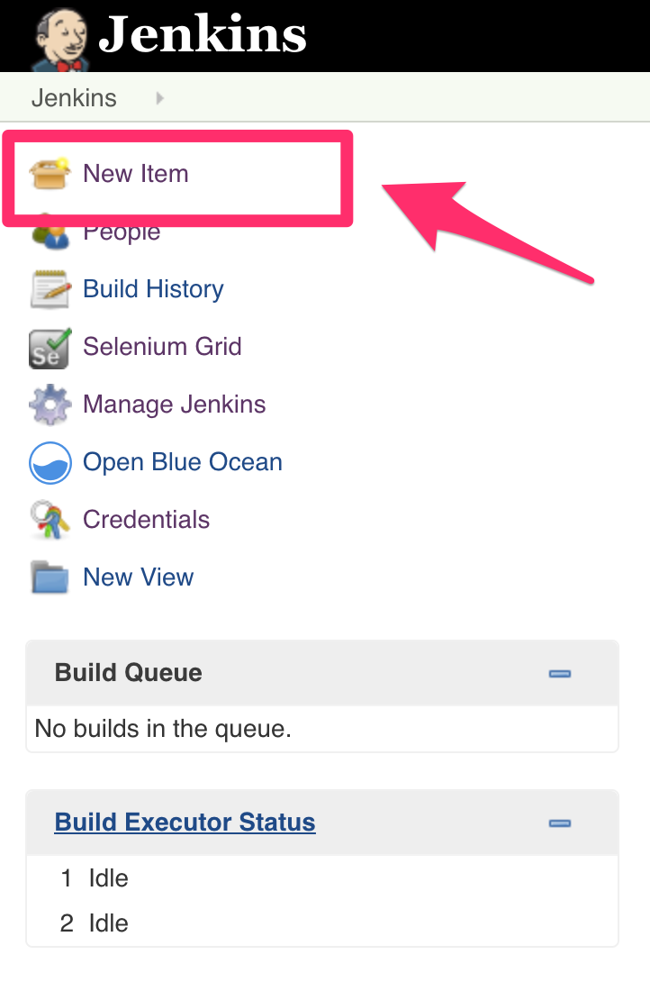

# devops-pipeline

(c) Adrian Newby, 2019

## Introduction

This repo provides a fairly comprehensive environment, suitable for a developer who wants a local DevOps pipeline in addition to whatever is available centrally (if anything). This provides a number of benefits:

* Instant feedback from local commits
* Lower burden on central resources
* Higher confidence in quality of code pushed to origin

__However:__ That doesn't mean this environment should be used as a substitute for central DevOps services, nor should this be seen as encouragement to delay committing work to origin.  Remember, it's not real until it's been pushed and high quality DevOps relies on each member of the team being able to see and incorporate the work of everybody else.

This project was inspired by the work of [Marcel Birkner](https://blog.codecentric.de/en/author/marcel-birkner/), who authored a great CI Platform in 2015: [Continuous Integration Platform Using Docker Containers: Jenkins, SonarQube, Nexus, GitLab](https://blog.codecentric.de/en/2015/10/continuous-integration-platform-using-docker-container-jenkins-sonarqube-nexus-gitlab/).

Why didn't I just use his work?  Good question.  Basically, I wanted a slightly more bare-bones approach, without the vast array of plugins and starter jobs he included.  I also decided it would be easier to build from the ground up, taking care of version updates as I went, rather then editing his original work, which is now several years old.

## Overview

What do you get out of the box?

The project provides the following components, all of which are essential for a modern DevOps pipeline:

* CI/CD Server - [Jenkins](https://jenkins.io/)
* Static Code Analysis - [SonarQube](https://www.sonarqube.org/)
* Automated Testing - [Jasmine](https://jasmine.github.io/), [Protractor](https://www.protractortest.org), JUnit??, NUnit??
* Artifact Repository - [Nexus](https://www.sonatype.com/nexus-repository-oss)
* Orchestrated Container Environment - [Kubernetes](https://kubernetes.io/)

For efficiency, all components are delivered as Docker containers.

## Prerequisites

To get started, you need a couple of things:

* [Docker](https://www.docker.com/get-started) - This entire project is delivered using Docker. If you're not familiar with containers, read [this](https://www.docker.com/resources/what-container) first.
* [Git](https://git-scm.com/) - The environment assumes you are working with a Git repository.  It will probably work with other repos but you will have to configure the hooks yourself.

If your environment is properly-configured, you should see something like this:

```
$ docker --version
Docker version 18.06.1-ce, build e68fc7a

$ git --version
git version 2.19.2
```

## Launching the environment

### Map your local repositories into Jenkins' filespace

In order for Jenkins to see your code repository, and detect buildable changes on commit, you need to map it to a known location in Jenkins' filespace.  To do this, declare an environment variable ```MY_REPOS```, which identifies the location of your local repository.

Notice that ```MY_REPOS``` is plural.  It's likely that you will have more than one repository you want to hook tyo a local CI/CD pipeline. The best way to do this is to arrange all your local repository clones under a common root, which you can then identify to ```MY_REPOS```:

```
MY_REPOS=/Users/acanewby/repos
export MY_REPOS
```

### Configured services and access points

| *Tool* | *Link* | *Credentials* |
| ------------- | ------------- | ------------- |
| Jenkins | http://localhost:18080/ | no login required |
| SonarQube | http://localhost:19000/ | admin/admin |
| Nexus | http://localhost:18081/ | admin/admin123 |

## Integrating with your local repository

The purpose of this project is to give the developer a *local* CI/CD pipeline to allow for more immediate feedback as commits are made locally, prior to pushing to origin.

This CI/CD pipeline is also not visible outside the local development environment.
 
Therefore, since no push to origin means no WebHook trigger, and since a WebHook couldn't reach the local CI/CD pipeline environment anyway, we need to hook to the local clone of the repository on the local filesystem.  

### Declare and configure a Jenkins build for your project

From the Jenkins home page, select New Item:



Create a Pipeline (using your repository name as the Pipeline name):


Configure Jenkins to use the Jenkinsfile in your repository:


Trigger builds from a Git hook:


### Add a hook in your repository to trigger a Jenkins build on commit

Now that Jenkins is ready to build on commit, you need to set up a git hook in your local repository. (Note: This hook will remain specific to your repository and will not be pushed to origin.  This is by design, since hooks are, by their nature, repository-specific.)

Create ```<your local repository>/.git/hooks/post-commit``` as follows"

```
#!/bin/bash
curl http://localhost:18080/git/notifyCommit?url=file:///repos/my-pipeline-project
```

Then, mark it world-executable:

```
chmod a+x <your local repository>/.git/hooks/post-commit
```


